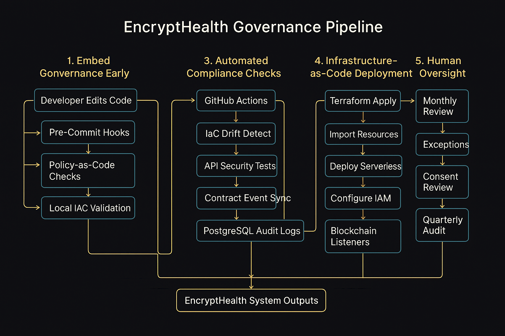

# EncryptHealth Governance Pipeline

## Governance Pipeline Overview

EncryptHealth uses a five-layer governance model to ensure security, compliance, and auditability.

### 1. Embed Governance Early
- Pre-commit hooks
- Secret scanning
- ESLint/Black
- Policy-as-code
- Terraform validate

### 2. Version Control & Peer Review
- Signed commits
- Branch protection
- Static scans
- PR workflow

### 3. Automated Compliance Checks
- GitHub Actions
- IaC drift detection
- API security tests
- Contract event sync
- PostgreSQL audit logs

### 4. Infrastructure-as-Code
- Terraform
- Import existing infra
- IAM + Secrets Manager
- API Gateway, Lambdas, DB
- Blockchain listeners

### 5. Human Oversight
- Monthly review
- Exception log
- Consent model review
- Quarterly ethical audit

## Governance Pipeline Diagram

[Mermaid diagram removed in this version to ensure valid heredoc]

