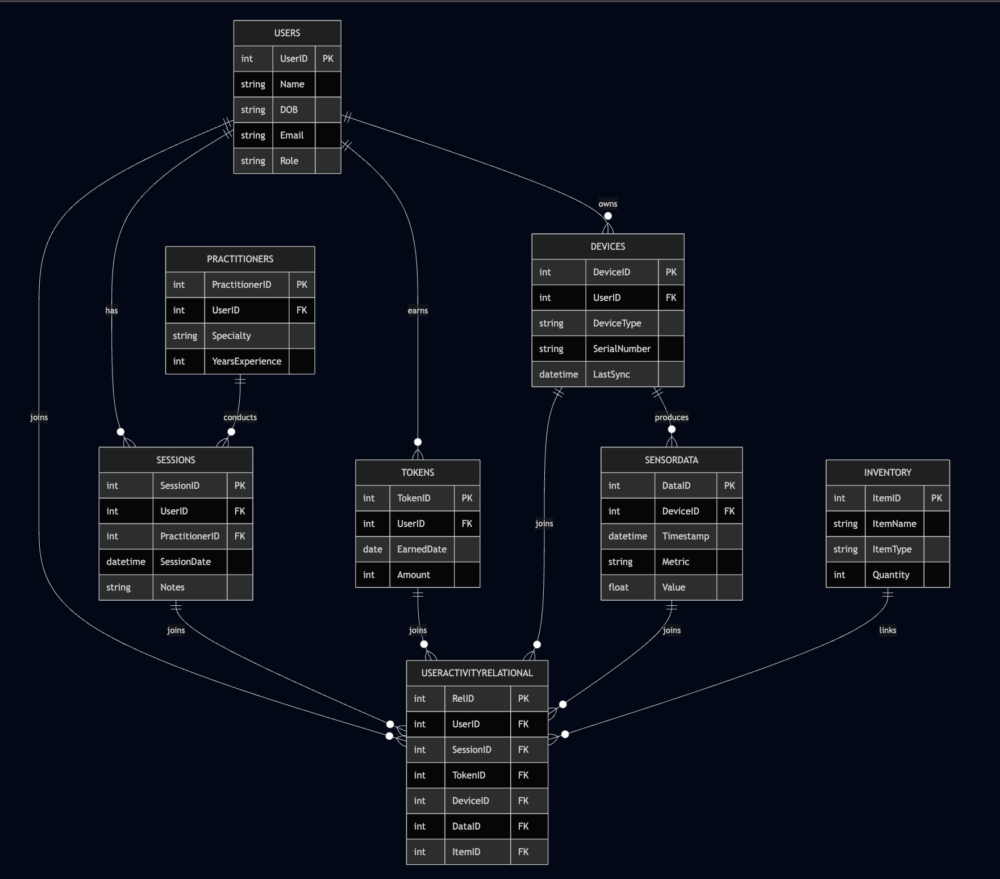

<!-- Rights Reserved, Unlicensed -->

# 🗂️ Data Layer Architecture  
This layer defines the off-chain relational structures, data ingestion logic, blockchain event mapping, and analytics foundation that supports the Future Systems Lab ecosystem.

---

# 1.0 Purpose  
The Data Layer provides a structured, queryable environment for:

- user activity logs  
- session details  
- device metadata  
- sensor datapoints  
- token reward events  
- inventory/protocol items  

It supports analytics, reporting, and simulation without storing PHI, ensuring pseudonymization and alignment with HIPAA and GDPR principles.

---

# 2.0 Relational Schema (SQLite)  
The schema below was executed and validated inside `MyProject.db` to demonstrate the full working prototype.

## 2.1 Users  
Basic user attributes (pseudonymized):

## 2.2 Practitioners  
Practitioner profile linked to a user record:

## 2.3 Sessions  
Session logs linked to user + practitioner:

## 2.4 Tokens  
Off-chain mirrors of on-chain token issuance:

## 2.5 Devices  

## 2.6 Sensor Data  

## 2.7 Inventory  

## 2.8 UserActivityRelational  
High-level cross-table linkage:

---

# 3.0 Entity-Relationship Diagram (ERD)

## 📊 Visual ERD (PNG)
<p align="center">
  
</p>

---

## 📐 Mermaid ERD (Source)
<details>
  <summary><strong>Click to view Mermaid ERD source</strong></summary>

```mermaid
erDiagram

    USERS ||--o{ SESSIONS : "has"
    USERS ||--o{ TOKENS : "earns"
    USERS ||--o{ DEVICES : "owns"

    PRACTITIONERS ||--o{ SESSIONS : "conducts"

    DEVICES ||--o{ SENSORDATA : "produces"

    USERS ||--o{ USERACTIVITYRELATIONAL : "joins"
    SESSIONS ||--o{ USERACTIVITYRELATIONAL : "joins"
    TOKENS ||--o{ USERACTIVITYRELATIONAL : "joins"
    DEVICES ||--o{ USERACTIVITYRELATIONAL : "joins"
    SENSORDATA ||--o{ USERACTIVITYRELATIONAL : "joins"
    INVENTORY ||--o{ USERACTIVITYRELATIONAL : "links"

    USERS {
        int UserID PK
        string Name
        string DOB
        string Email
        string Role
    }

    PRACTITIONERS {
        int PractitionerID PK
        int UserID FK
        string Specialty
        int YearsExperience
    }

    SESSIONS {
        int SessionID PK
        int UserID FK
        int PractitionerID FK
        datetime SessionDate
        string Notes
    }

    TOKENS {
        int TokenID PK
        int UserID FK
        date EarnedDate
        int Amount
    }

    DEVICES {
        int DeviceID PK
        int UserID FK
        string DeviceType
        string SerialNumber
        datetime LastSync
    }

    SENSORDATA {
        int DataID PK
        int DeviceID FK
        datetime Timestamp
        string Metric
        float Value
    }

    INVENTORY {
        int ItemID PK
        string ItemName
        string ItemType
        int Quantity
    }

    USERACTIVITYRELATIONAL {
        int RelID PK
        int UserID FK
        int SessionID FK
        int TokenID FK
        int DeviceID FK
        int DataID FK
        int ItemID FK
    }

| Blockchain Event        | SQL Table / Field                | Purpose                  |
| ----------------------- | -------------------------------- | ------------------------ |
| `SessionLogged`         | Sessions.SessionID               | Session record anchor    |
| `ConsentUpdated`        | Users.Role / metadata tables     | Consent state mapping    |
| `TokenEarned` (HNT/EHT) | Tokens.Amount, Tokens.EarnedDate | Reward accounting        |
| `DeviceLinked`          | Devices.DeviceID                 | Device identity tracking |
| `NFTUnlocked`           | Inventory / Protocol entries     | Stage unlock metadata    |
SELECT u.Name, s.SessionDate, t.Amount AS TokensEarned
FROM Users u
JOIN Sessions s ON u.UserID = s.UserID
JOIN Tokens t ON u.UserID = t.UserID;

SELECT u.Name, d.DeviceType, sd.Metric, sd.Value
FROM Users u
JOIN Devices d ON u.UserID = d.UserID
JOIN SensorData sd ON d.DeviceID = sd.DeviceID;

SELECT u.Name, SUM(t.Amount) AS TotalTokens
FROM Users u
JOIN Tokens t ON u.UserID = t.UserID
GROUP BY u.UserID;

SELECT u.Name, s.SessionDate, t.Amount AS Tokens, d.DeviceType, sd.Metric, i.ItemName
FROM UserActivityRelational r
JOIN Users u ON r.UserID = u.UserID
JOIN Sessions s ON r.SessionID = s.SessionID
JOIN Tokens t ON r.TokenID = t.TokenID
JOIN Devices d ON r.DeviceID = d.DeviceID
JOIN SensorData sd ON r.DataID = sd.DataID
JOIN Inventory i ON r.ItemID = i.ItemID;

SELECT u.Name, s.SessionDate, t.Amount AS TokensEarned
FROM Users u
JOIN Sessions s ON u.UserID = s.UserID
JOIN Tokens t ON u.UserID = t.UserID;

SELECT u.Name, d.DeviceType, sd.Metric, sd.Value
FROM Users u
JOIN Devices d ON u.UserID = d.UserID
JOIN SensorData sd ON d.DeviceID = sd.DeviceID;

SELECT u.Name, SUM(t.Amount) AS TotalTokens
FROM Users u
JOIN Tokens t ON u.UserID = t.UserID
GROUP BY u.UserID;

SELECT u.Name, s.SessionDate, t.Amount AS Tokens, d.DeviceType, sd.Metric, i.ItemName
FROM UserActivityRelational r
JOIN Users u ON r.UserID = u.UserID
JOIN Sessions s ON r.SessionID = s.SessionID
JOIN Tokens t ON r.TokenID = t.TokenID
JOIN Devices d ON r.DeviceID = d.DeviceID
JOIN SensorData sd ON r.DataID = sd.DataID
JOIN Inventory i ON r.ItemID = i.ItemID;
7.0 Off-Chain Storage Standards

SQLite (demo): lightweight and portable

PostgreSQL (recommended): ACID-compliant, scalable

No PHI stored: only pseudonymized signals

Externalized sensitive data: off-chain only

Hash-linking: verify on-chain without exposing data

8.0 Summary

The Data Layer provides a structured, analytics-ready foundation for the Future Systems Lab ecosystem.
It integrates wearable signals, session activity, consent events, reward logic, device metadata, and inventory structures into a consistent relational model.
This layer forms the bridge between real-world interaction data and blockchain-based auditability, enabling transparent analytics, scalable evolution, and decentralized governance.
---

### When done, run:

```bash
cd ~/Future-Systems-Lab
git add architecture/Data-Layer.md
git commit -m "Update Data Layer with PNG + Mermaid ERD"
git push

